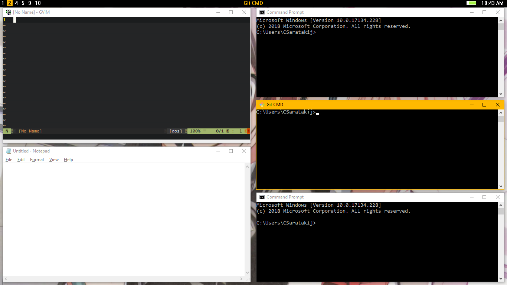

# MyWinTiles

- Tiling window manager for Windows 10
- Built on top of explorer shell
- Inspired by i3 window manager

# Dependencies
- Visual Studio 2017
- Visual C++
- Windows 10 SDK
- AutoHotkey

# Getting Start
1. Disable Windows global hotkey and restart your computer
```
HKEY_CURRENT_USER\Software\Microsoft\Windows\CurrentVersion\Policies\Explorer
NoWinKeys REG_DWORD 0x00000001 (1)
```
2. Compile & Run

# Keyboard shortcut
- Take a look at [Default keyboard shortcut](Keybind.md)

# Additional
- You might want to use [MyWinBar](https://github.com/CSaratakij/MyWinBar), an AppBar for MyWinTiles.

# Issue
- Test with Windows 10 (Other windows version don't officially support.)
- If you want to control some window that start with admin permission, Run this program as adminstrator.
- Please make sure to run on single instance, terminate this program by Task Manager before restart this program.
- Some key might interfere with how MyWinTiles behaves, Use [AutoHotkey](https://autohotkey.com/) with [disable key script](interfere_keys.ahk)
(Run as Startup is recommend)

# License
- [GNU GPLv3](LICENSE)
